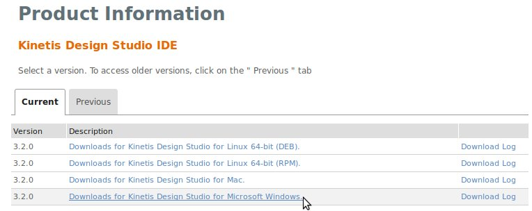

.. index:: development

.. _develop:

Developing Guide
================

This guide will provide instructions to install the development environment needed to compile and debug the demo firmware for the FRDM-K82L. The development system is multiplatform, it supports Windows and Linux. This guide is written using Windows.
The main steps are:

- Install Kinetis Design Studio 3.2.0

- Build & Install KSDK 2.0 for FRDM-K82F board

- Import & build the source project

Install & Update Kinetis Design Studio
--------------------------------------

1. First up, register at the NXP website `registration form <https://www.nxp.com/webapp/crcl.ccr_register.framework?ACTION_TYPE=registerpage>`_ then you can download the IDE from `this page <http://www.nxp.com/products/software-and-tools/run-time-software/kinetis-software-and-tools/ides-for-kinetis-mcus/kinetis-design-studio-integrated-development-environment-ide:KDS_IDE>`_. Press on **Download** button.

We used Kinetis Design Studio **3.2.0**, press on **Downloads for Kinetis Design Studio for Microsoft Windows**. 

Agree the terms and download the file **Installer: Kinetis Design Studio 3.2.0 Installer for Windows**.

Next, run the downloaded file **kinetis-design-studio_3.2.0.exe** following all the default options.

2. Now we have to download and extract the KSDK 2.0 for the **FRDM-K82F** board. We will build the SDK through this website: `nxp website <http://kex.nxp.com>`_. Click on **Build SDK**. You have to register in order to use this feature.

Will appear a list of boards, select the **FRDM-K82F**

Now it is necessary build the SDK package before to download. Click on **Build SDK Package**.

From the **Software Vault** link you will see the message **Pending download approval**. You have to wait some minute.

After the approval phase you will can download the SDK built. Accept the terms and download the **evNXPv01.zip** file.

Build the Project
-----------------

1. Launch KDS and select a directory for the workspace. Our project will be imported in this folder. In this guide we used this path:

.. image:: _static/kds_workspace.jpg

2. Follow next steps: 

    a. Unzip the **evNXPv01.zip** file into the workspace creating a new folder named **SDK_2.0_FRDM-K82F**. 

    b. Download the sources of the **DEMO_usb_device_video_flexio_ov7740** clicking `here <_static/404>`_

    c. unzip it in the folder **UNIT:\\[YOUR PATH TO]\\workspace\\SDK_2.0_FRDM-K82F\\boards\\frdmk82f\\demo_apps**.

3. From the **Kinetis Design Studio** select **File -> import**. 
Then choose **General -> Existing Projects into Workspace**

    .. image:: _static/kds_archive.jpg

    a. In **Select root directory**, click on **Browse** and select the path: 

    ::

        UNIT:\\[YOUR PATH TO]\\SDK_2.0_FRDM-K82F\\boards\\frdmk82f\\demo_apps\\DEMO_usb_device_video_flexio_ov7740

    The project should be automatically detected and selected. 

    b. Click on **Finish**.

    .. image:: _static/import_project.jpg

5. Before to build it's necessary setup the configuration of the project to create the **hex** file to upload in the board. 

    a. Click on **Project -> Properties** 

    b. select **C/C++ Build -> Settings** 

    c. click on the **Toolchains** tab, then check the options **Create flash image** and **Print size**.

    d. click on **Apply**

    .. image:: _static/configuration1.jpg

    e. After select the **Tool Settings** tab

    f. click on **Cross ARM GNU Create Flash Image -> General**

    g. choose as **Output file format** the **Intel HEX** option.

    .. image:: _static/configuration2.jpg
    
    h. click on **Apply**

    i. Apply the modifies clicking on **Ok** button

    j. build the project selecting **Project -> Build All**.

6. In **UNIT:\\[YOUR PATH TO]\\SDK_2.0_FRDM-K82F\\boards\\frdmk82f\\demo_apps\\DEMO_usb_device_video_flexio_ov7740\\bm\\kds\\debug** folder you will find your hex file: **dev_video_flexio_ov7740_bm_frdmk82f.hex**.

7. The **dev_video_flexio_ov7740_bm_frdmk82f.hex** file is the firmware demo uploadable in the FRDM-K82F, it is used in :ref:`quick`

