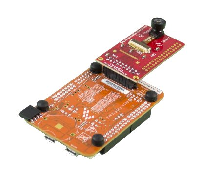

.. K82F-TD7740 documentation master file

Welcome to Embedded Vision NXP documentation
============================================

:Version: 1.00D
:Copyright: (C)2016 Avnet Silica company
:Date: 18 Oct 2016
:Reference name: EV-NXPKINCAM-DVK

Embedded Vision NXP
-------------------

*FRDM-K82F with TDNx016 board mounting a TD7740 camera module*

.. note::

  **Visit** `www.avnet-silica.com/embedded-vision <http://www.avnet-silica.com/embedded-vision>`_ **to buy this development kit**

.. warning::

  The color of the adapter board in the kit can be different than the color on the images in the Quick Start Guide and Developing Guide. However this does not affect the functionality of the board

.. index:: index

**INTRODUCTION**
----------------

The **NXP Freedom K82F** is an low-cost development platform for Kinetis K82, K81, and K80 MCUs. Provided with Kinetis MK82FN256VLL15 MCU (ARM® Cortex®-M4 @150 MHz, 256KB SRAM, USB and advanced security).

- Form-factor compatible with the Arduino™ R3 pin layout
- Peripherals enable rapid prototyping, including a six-axis digital accelerometer and magnetometer to create full eCompass capabilities, a tri-colored LED and two user push-buttons for direct interaction, 2x32Mb QuadSPI external flash, FlexIO camera header, touch pads and headers for use with Bluetooth® and 2.4 GHz radio add-on modules
- OpenSDAv2.1, the NXP open source hardware embedded serial and debug adapter running an open source bootloader, offers options for serial communication, flash programming, and run-control debugging

The **TD7740** Image sensor is based on Omnisvision 1/5" OV7740 CMOS VGA sensor.

- Solderless module: Camera Socket (SMK compatible) or Flex connector (FPC: Flat Pack Connector) 8 x 8 mm module mate on standard Camera Module Socket
- Active Image size VGA (640x480) 30 fps, and smaller
- Digital RGB 8/10 bits or YUV 8 bits output
- Lens Focal length 1.3 mm Field of view from H=66° to 128°
- Pixel size 4.2µm x 4.2µm
- Type of filter; dual filter for daylight and night vision, single filter for daylight vision, no filter for higher image quality
- Power supply Analog: 3 to 3.6 V I/O: 1.7 to 3.47 V Core: 1.5V +-5% (internal regulator)
- Typical power requirements Active: 48 mA Standby: 20 µA Core: 1.5V +-5% (internal regulator)
- Operating range -30°/70°C stable image 0°/50°C

Development tools
*****************

NXP releases Kinetis® Design Studio including support for FRDM-K82F. The Kinetis® Design Studio (KDS) is a complimentary integrated development environment for Kinetis MCUs that enables robust editing, compiling and debugging of your designs. Based on free, open-source software including Eclipse, GNU Compiler Collection (GCC), GNU Debugger (GDB), and others, the Kinetis Design Studio IDE offers designers a simple development tool with no code-size limitations. Furthermore, Processor Expert® software enables your design with its knowledge base and helps create powerful applications with a few mouse clicks.

**Features**

- Eclipse Luna 4.4
- Host operating systems:

  -  Windows® 7/8/10 (32 and 64-bit)
  -  Linux® 64-bit (Ubuntu 10.04 (deb), RedHat/Centos 7 (rpm))
  -  Mac OS X (10.10 and 10.11) with SEGGER J-Link support

- GDB debugger with support for the following debug interface hardware:

  - SEGGER J-Link (w/SEGGER GDB Server, Windows, Linux, Mac)
  - P&E Multilink (w/P&E GDB Server, Windows, Linux)
  - CMSIS-DAP (w/OpenOCD GDB and OpenSDA embedded circuit,Windows, Linux)
  - Command Line (CL) debugging with GDB and OpenOCD TCL

Contents:

.. toctree::
   :maxdepth: 2

   qs
   develop

