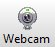

.. index:: qs

.. _quick:

Quick Start Guide
=================

This guide will show you how run the demo. This demo permits you to try immediatly the **TD7740** camera. This guide is written using **Windows** Operating System.

Run the Demo
------------

1. Solder a 9x2 female connector to the flexIO camera pins, be careful to solder it on the back of the board such as this:

.. image:: _static/strip.jpg

2. Install OpenSDA for the Freescale k82f board More information can be found at `segger website <https://www.segger.com/downloads/jlink>`_. Click on **J-Link OpenSDA - Board-Specific Firmwares** and download the firmware for the **FRDM-K82F**.

.. image:: _static/download-OpenSDA.jpg

3. Start your board in Bootloader mode keeping reset button pressed, while connecting the USB cable to the **SDA USB** port and release it after 1s. Drag'n drop or copy and paste the OpenSDA Application binary file into the **BOOTLOADER** drive from your computer file explorer. After 10 seconds Un-plug and re-plug the USB cable from the SDA USB port **without** keeping reset button pressed.

.. image:: _static/board_k82f_guide.jpg

4. Download the `demo firmware <_static/dev_video_flexio_ov7740_bm_frdmk82f.hex>`_ and Drag'n drop or copy and paste the OpenSDA Application binary file into the **MBED** drive from your computer file explorer. After 10 seconds Un-plug and re-plug the USB cable from the SDA USB port **without** keeping reset button pressed.

.. note::

  You can build this demo firmware by yourself. Please follow the instructions in the :ref:`develop` section.

5. Plug the TD7740 camera to the TDx016 adapter board and Connect the board to the FRDM-K82F board.

.. image:: _static/board.jpg

6. Plug in the micro USB cable in the USB device port (the one in the middle of the card).

.. image:: _static/board_k82f_guide2.jpg

7. The board will enumerate as a generic USB video device called **Flexio Camera Device**. You can then use this device with any video capture software such as `Debut Video Capture Software <http://www.nchsoftware.com/capture/index.html>`_. Download and install it. Launch it and select the webcam icon.

You will see the frames transmitted from the **Flexio Camera Device**.

