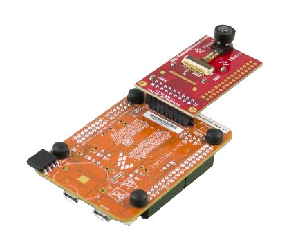
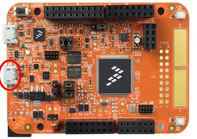
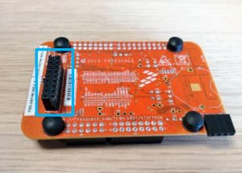
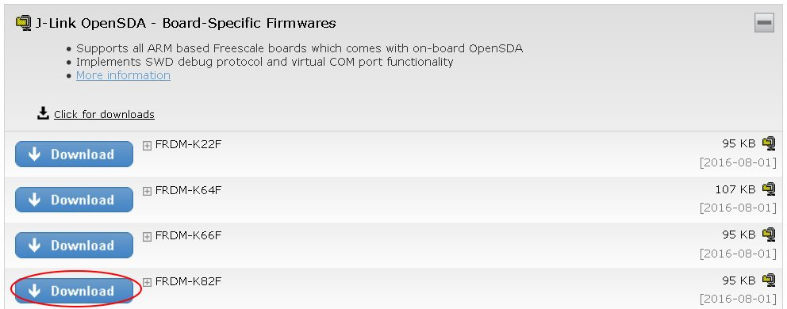
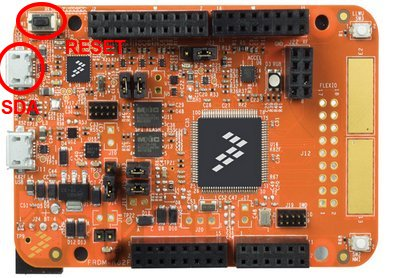

.. index:: qs

.. _quick:

Quick Start Guide
=================

This guide will show you how run the demo. This demo permits you to try immediately the **TD7740** camera. This guide is written using **Windows** Operating System.

Hardware necessary
------------------

- TDNx016 Board
- TD7740 camera
- FRDM-K82F board
- 1 micro-USB cable
- PC with Windows

The Demo
--------

The demo is already programmed on the FRDM-K82F board. You have only to connect the boards in order to use the demo. Please follow the next steps:

1. Plug the **TD7740** camera to the **TDx016 adapter** board and Connect the board to the **FRDM-K82F** board.

2. Plug in the **micro USB** cable in the USB device port (the one in the middle of the card).

3. The board will enumerate as a generic USB video device called **Flexio Camera Device**. You can then use this device with any video capture software such as "camera" from Windows 10 or `AMCap <http://noeld.com/programs.asp?cat=video>`_. Download and install it if you don't have camera application on your O.S. Launch it and select the **Flexio Camera Device** device. You will see the frames transmitted at a resolution **QQVGA** of **160x120** pixels.

Update the Demo
---------------

If you need upload the demo in the FRDM-K82F board please follow the next steps:

1. This demo is provided with a **9x2 female connector** already soldered. This will be used to connect the board to the TDNx016 board:

2. Install OpenSDA for the NXP K82F board More information can be found at `segger website <https://www.segger.com/downloads/jlink>`_. Click on **J-Link OpenSDA - Board-Specific Firmwares** and download the firmware for the **FRDM-K82F**.

3. Start your board in Bootloader mode keeping reset button pressed, while connecting the USB cable to the **SDA USB** port and release it after 1s. Drag'n drop or copy and paste the OpenSDA Application binary file into the **BOOTLOADER** drive from your computer file explorer. After 10 seconds Un-plug and re-plug the USB cable from the SDA USB port **without** keeping reset button pressed.

4. Download the demo firmware from `Avnet Silica website <http://registration.silica.eu/other/embedded-vision-software-update-nxp.html>`_ and Drag'n drop or copy and paste the OpenSDA Application binary file into the **MBED** drive from your computer file explorer. After 10 seconds Un-plug and re-plug the USB cable from the SDA USB port **without** keeping reset button pressed.

.. note::

  You can build this demo firmware by yourself. Please follow the instructions in the :ref:`develop` section.

5. Plug the **TD7740** camera to the **TDx016 adapter** board and Connect the board to the **FRDM-K82F** board.

6. Plug in the **micro USB** cable in the USB device port (the one in the middle of the card).

7. The board will enumerate as a generic USB video device called **Flexio Camera Device**. You can then use this device with any video capture software such as "camera" from Windows 10 or `AMCap <http://noeld.com/programs.asp?cat=video>`_. Download and install it if you don't have camera application on your O.S. Launch it and select the **Flexio Camera Device** device. You will see the frames transmitted at a resolution **QQVGA** of **160x120** pixels.

